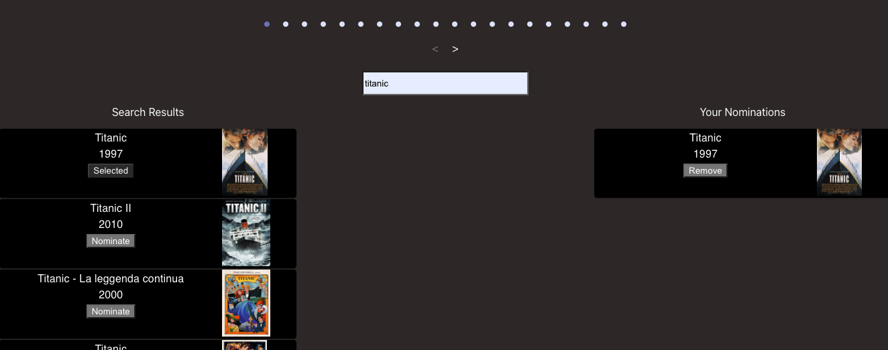
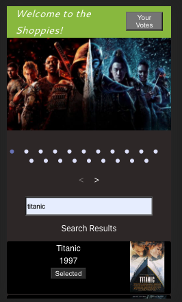

  # The Shoppies

  Deploy Link: <a href="https://bjh-shopify-intern.herokuapp.com/">The Shoppies</a>

  ## Description

  A MERN application where the user may search for films and nominate them. Once they have voted for 5 films, they will not be able to add anymore and a banner will display indicating they are done.

  ## Images

  

  

  
  ## Table of Content

  * [Installation](#installation)

  * [Usage](#usage)

  * [License](#license)

  * [Contributing](#contributors)

  * [Contact](#questions/contact)

  ## Installation

  To Install necessary dependencies, run the following command:
  
  npm i

  ## Usage

Use the search bar below the featured carousel to search for films. To add a film to your nomination list, hit the button on the search result card. To remove a film from the nomination list, hit the remove button. If you do not see your nomination list, your view window is to small for them to be displayed with the search results so either scroll down to the bottom or hit the button on the header.
  
  ## Technologies

      ReactJS, MongoDB, JavaScript, HTML, CSS, API's, Express, Material-Ui, and Cors.

  ## Contributors

  Ben Hopkins

  ## Questions/Contact

  <a href="https://github.com/bh007183">GitHub Profile</a>
  <a href="mailto:bjhops17@gmail.com"> Email Me</a>

  Deploy Link: <a href="https://bjh-shopify-intern.herokuapp.com/">The Shoppies</a>
  
  

  